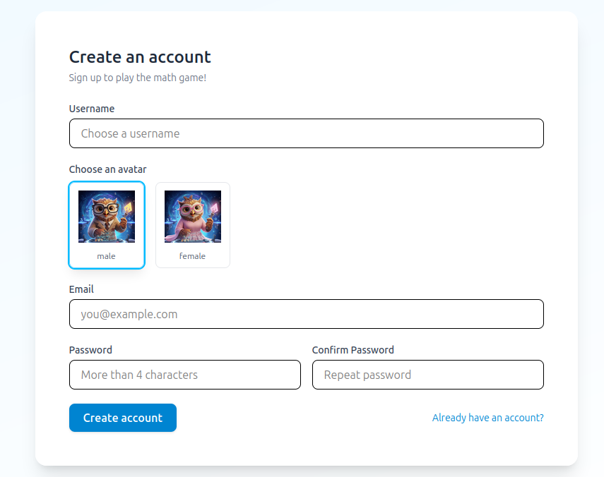
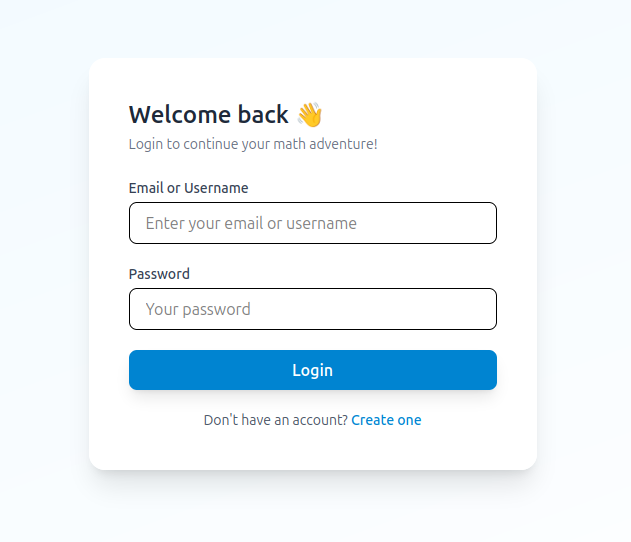
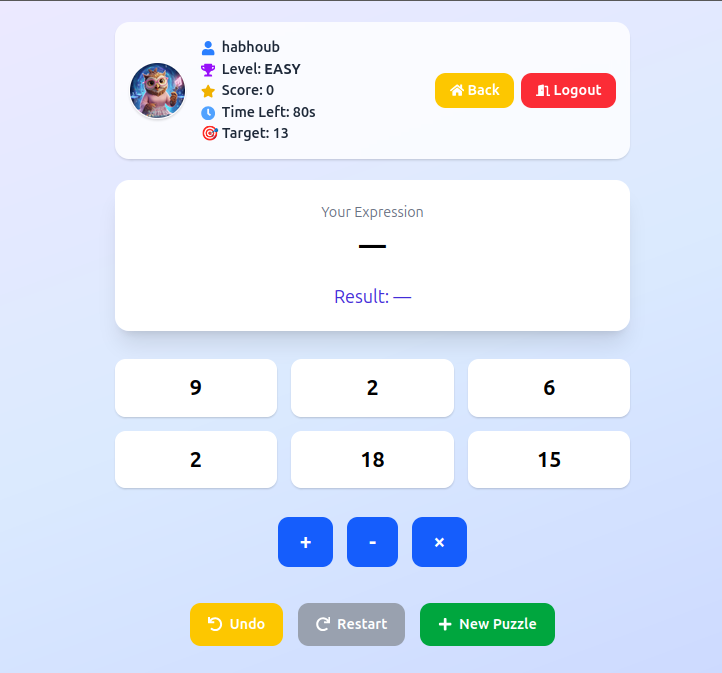
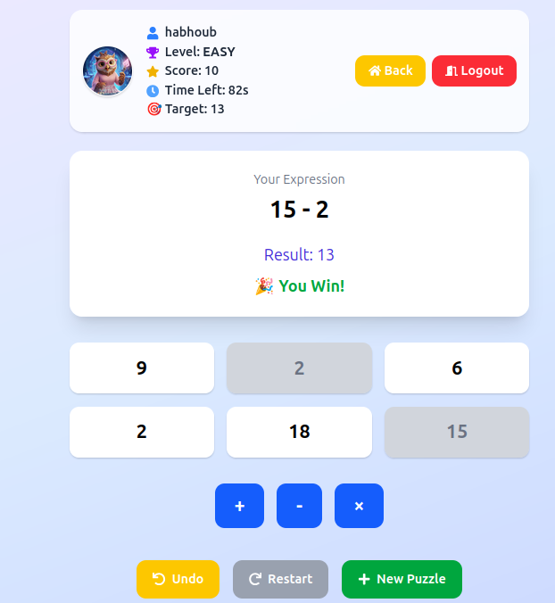
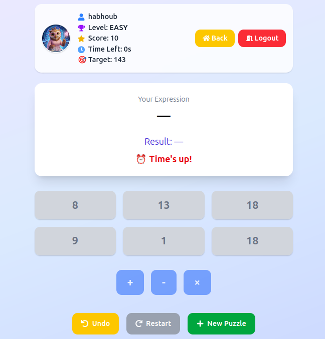
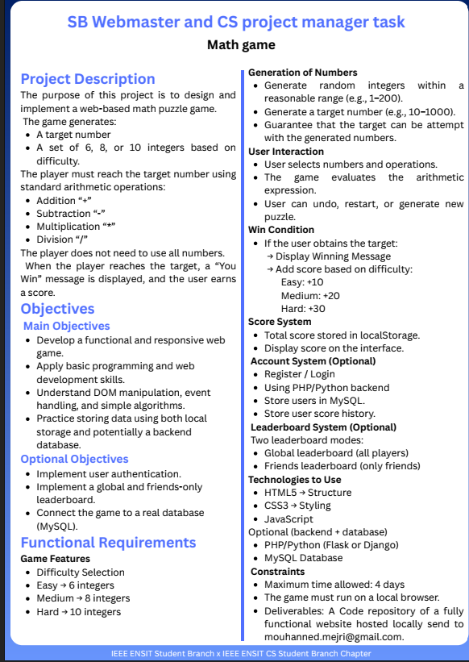

# Math-Game

**IEEE ENSIT TASK**  

A mini **MERN stack** math game application that allows users to log in, choose difficulty levels, and solve math challenges.  

## Technologies Used
- **Frontend:** React.js + Tailwind CSS  
- **Backend:** Node.js (Express) + MongoDB  
- **Features:**  
  - User authentication with JWT  
  - Protected routes (no access without login)  
  - Form validation on both frontend and backend  
  - Randomized math challenges based on difficulty  

This project is a **simple and basic application**, designed to demonstrate full-stack development concepts in a fun and interactive way.

---

## Screenshots

**Register Page**  


**Login Page**  


**Welcome Page**  


**Game Page**  


**Win Screen**  


**Lose Screen**  


**Requirements**  


---

## Highlights
- Responsive and user-friendly interface  
- Score tracking with win/lose feedback  
- Random number generation for each difficulty:  
  - Easy: 1–999  
  - Medium: 1000–9999  
  - Hard: 10000–999999  

---

## How to Run

1. Clone the repository:  
   ```bash
   git clone <repo-url>
